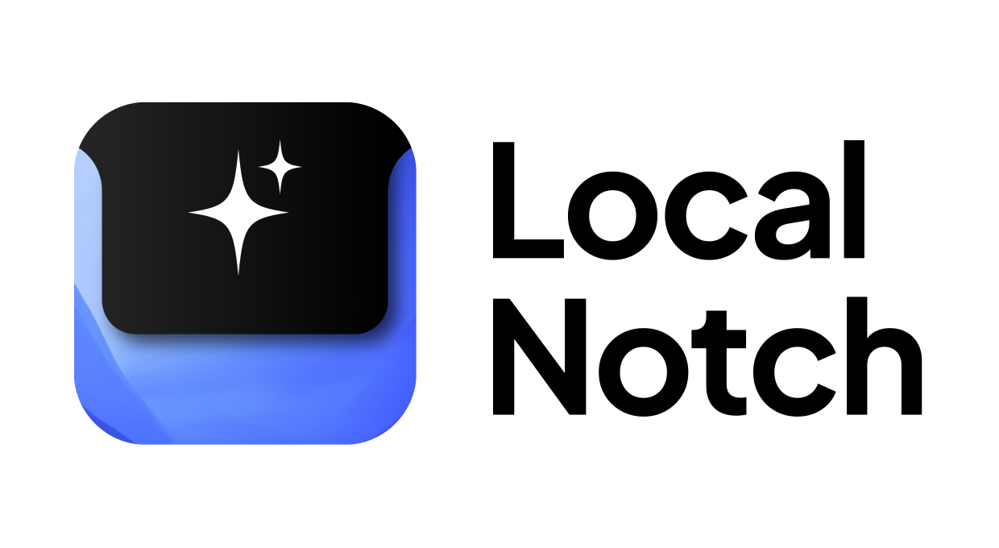

<p align="center">
  
</p>

LocalNotch is a macOS AI assistant that lives in your MacBook's notch. Hover to open, type to ask anything — then it disappears. No window to manage, no app to switch to. Everything runs locally through [Ollama](https://ollama.com): your conversations, your screenshots, your data — nothing leaves your machine. Optionally wire in a Brave Search API key and it gains real-time web search, decided automatically by a 3-layer classifier.

<p align="center">
  
</p>

> **This is beta software.** LocalNotch is v0.1.0 and actively developed. You may encounter bugs, rough edges, and missing features. Apple Silicon only. See [Known Limitations](#known-limitations) before installing.

---

## Table of Contents

- [Features](#features)
- [Requirements](#requirements)
- [Installation](#installation)
- [First Launch: Onboarding](#first-launch-onboarding)
- [Using LocalNotch](#using-localnotch)
- [Settings](#settings)
- [Web Search](#web-search)
- [Privacy](#privacy)
- [Building from Source](#building-from-source)
- [Architecture Overview](#architecture-overview)
- [Known Limitations](#known-limitations)
- [FAQ & Troubleshooting](#faq--troubleshooting)
- [Credits](#credits)
- [License](#license)

---

## Features

- **Lives in the notch** — expands on hover, collapses on mouse-out, stays completely out of your way when idle
- **Fully local inference** — runs any model you have installed in Ollama; nothing is sent to any cloud service
- **Vision** — tap the camera button to capture your screen and ask questions about it; long-press to clear the screenshot
- **Hybrid web search** — bring your own Brave Search API key; a 3-layer classifier (explicit triggers → keyword detection → LLM) decides when to search automatically
- **Web search badge** — a pulsing dot appears while a search is in flight; a globe badge persists while the model is responding so you always know when live data was used
- **Weather & time** — the idle screen shows current temperature (Fahrenheit), feels-like, humidity, and condition alongside today's date and live clock; refreshes every 10 minutes via [wttr.in](https://wttr.in) — no account or API key required
- **Personalized greeting** — set your name in onboarding or Settings and the idle screen greets you
- **Chat history panel** — view all turns from the current session; tap any response to expand it in full
- **In-session reset** — the counterclockwise arrow button wipes the current response with an animated fade and clears the full conversation history
- **Guided onboarding** — detects Ollama on first launch, walks you through model selection and optional web search setup; progress is saved so you can quit mid-flow and resume where you left off
- **Settings** — switch models, update your API key, change your name, and fully customize the system prompt; open with ⌘, from the menu bar
- **Markdown rendering** — responses support bold, italic, code spans, code blocks (horizontally scrollable), blockquotes, tables, and headings
- **Liquid Glass UI** — native macOS 26 Tahoe glass effect on the input pill, buttons, and badges; clean frosted-glass fallback on macOS 14/15
- **Compact notch indicator** — a pulsing dot in the collapsed notch shows the model is thinking; a green checkmark appears when it finishes

---

## Requirements

| Requirement | Details |
|---|---|
| macOS | 14 (Sonoma) or later. macOS 26 (Tahoe) required for Liquid Glass. |
| Architecture | Apple Silicon (M1 or newer). Intel is not supported. |
| Ollama | Must be installed and running before first launch. |
| Display | A Mac with a physical notch (MacBook Pro 14"/16", MacBook Air M2/M3, etc.). |

---

## Installation

### Option A — Download (recommended)

1. Download `LocalNotch.zip` from [Releases](https://github.com/s24b/LocalNotch/releases).
2. Unzip and drag `LocalNotch.app` to your Applications folder.
3. **Do not double-click to launch.** macOS will block it because the app is ad-hoc signed, not notarized.
4. To bypass Gatekeeper — the steps differ by macOS version:
   - **macOS 14 (Sonoma):** Right-click `LocalNotch.app` → **Open** → click **Open** in the dialog. Done.
   - **macOS 15 (Sequoia) or macOS 26 (Tahoe):** Right-click → Open no longer bypasses Gatekeeper. Instead: attempt to open the app (it will be blocked), then open **System Settings → Privacy & Security**, scroll to the **Security** section at the bottom, and click **Open Anyway**. Confirm your password and click **Open Anyway** again.
   - **Terminal fallback (works on all versions):** `xattr -dr com.apple.quarantine /Applications/LocalNotch.app`

   Either way, you only need to do this once — after that you can launch normally.
5. When prompted, grant **Screen Recording** permission. This is required to capture screenshots for vision queries.

### Option B — Build from source

```bash
git clone https://github.com/s24b/LocalNotch.git
cd LocalNotch
./scripts/release.sh
```

The script compiles a release binary, assembles a proper `.app` bundle, ad-hoc signs it, and produces `LocalNotch.zip` in the repo root. Unzip and move to Applications, then follow the Gatekeeper bypass steps in [Installation → step 4](#installation) for your macOS version.

See [Building from Source](#building-from-source) for full details.

---

## First Launch: Onboarding

On first launch the notch expands automatically and walks you through a 6-step setup. Your progress is saved to disk — if you quit mid-flow, reopening the app resumes exactly where you left off.

### Step 1 — Ollama check

LocalNotch probes `http://localhost:11434` to see whether Ollama is running.

- **Detected:** advances automatically after a brief confirmation.
- **Not running:** shows an "Open Ollama" button (opens `/Applications/Ollama.app`) and a "Check again" button.
- **Not installed:** shows a "Get Ollama" button linking to [ollama.com](https://ollama.com).

### Step 2 — Your name *(optional)*

Enter a first name. The idle screen will greet you with "Hello, [name]." every time you open the notch. You can skip this and set it later in **Settings → Personality**.

### Step 3 — Choose a text model *(required)*

A dropdown lists every text model installed in Ollama. You must select one to continue — this model handles all chat and reasoning, including the web search classifier.

**Recommended models:**

```bash
ollama pull gemma3:4b      # fast, lightweight
ollama pull gemma3:12b     # higher quality
ollama pull qwen2.5:7b     # good all-rounder
```

### Step 4 — Vision model *(optional)*

If your text model already supports vision natively (e.g. a Llama 3.2 multimodal variant), this step shows a "Vision included" confirmation and auto-advances.

Otherwise, a dropdown shows only vision-capable models. You can skip this if you don't need screenshot analysis and add one later in Settings.

**Recommended vision models:**

```bash
ollama pull llama3.2-vision   # recommended — mllama architecture
ollama pull llava:7b          # lighter alternative
ollama pull moondream         # smallest footprint
```

### Step 5 — Web search API key *(optional)*

Paste a [Brave Search API key](https://api.search.brave.com/register) to enable live web search. The free tier provides 1,000 queries/month. You can skip this now and add it later in **Settings → Web Search**.

### Step 6 — Done

A confirmation screen. Click "Let's go" to close onboarding and start using the app. You can re-run onboarding at any time via **Settings → About → Show onboarding again**.

---

## Using LocalNotch

### Opening and closing

- **Hover over the notch area** → the panel expands
- **Move your cursor away** → the panel collapses after a 200ms grace period

### Typing and sending

- **Hover over the "Ask anything" pill** → it expands into a text field
- **Type your message**, then press **Return** or click the ↑ button
- While the model is loading, the ↑ button becomes a spinner; the notch's compact trailing area shows a pulsing dot
- When the model finishes, a green checkmark appears briefly in the compact notch

### Controls reference

| Control | Location | Action |
|---|---|---|
| ↺ (counterclockwise arrow) | Left sphere | Reset chat: clears history, cancels any in-flight request, wipes the current response with an animated fade |
| Clock icon | Right sphere | Open chat history for this session |
| Camera / viewfinder | Right of input pill | Tap: capture a screenshot; appears when input is expanded |
| Camera (long-press 1 second) | Camera button | Clear a previously captured screenshot; a progress ring fills while you hold |
| ⌘, | Menu bar sparkle icon | Open Settings |
| ⌘Q | Menu bar sparkle icon | Quit LocalNotch |
| ⌘Z / ⌘⇧Z | Input field | Undo / Redo |
| ⌘C / ⌘X / ⌘V | Input field | Copy / Cut / Paste |
| ⌘A | Input field | Select all text in the input field |

### Screenshot / vision workflow

1. Expand the input by hovering the pill.
2. Tap the camera button on the right. A white flash confirms the capture; the button thumbnail previews the screenshot.
3. Type your question about the screenshot, then send.
4. If using a vision model, animated dots appear while the model processes the image (vision models take noticeably longer than text models before the first token arrives).
5. Long-press the camera button (1 second, the progress ring fills) to discard the screenshot and return to text-only mode.

---

## Settings

Open Settings with **⌘,** from the menu bar sparkle icon. Settings opens in a separate 360 × 480 window. Navigate with the section list; tap the back chevron to return.

### Models

Displays two filtered dropdowns:

- **Text model** — shows only non-vision models from Ollama. If all your models are multimodal, all models are shown instead.
- **Vision model** — shows only vision-capable models (CLIP, mllama, moondream, LLaVA, etc.).

A **Refresh** button re-fetches the model list from Ollama. A status line shows how many text and vision models are available, or warns if Ollama is unreachable.

### Web Search

A masked text field for your Brave Search API key. Click the eye icon to reveal the key. A status line confirms whether web search is enabled or disabled. See [Web Search](#web-search) for full details.

### Personality

- **Display name** — the name shown in your idle-screen greeting.
- **System prompt** — a multiline editor for the full system prompt sent to the model on every turn. The default prompt includes tone, behavior, and web search instructions. A **Reset to default** button restores the original; tap it once to arm (shows "Tap again to confirm"), tap again within 3 seconds to confirm.

### About

- Version number (v0.1.0-beta)
- GitHub link
- MIT License link
- **Show onboarding again** — re-runs the full 6-step onboarding flow

---

## Web Search

LocalNotch includes automatic web search powered by the [Brave Search API](https://api.search.brave.com). When a Brave API key is configured, the app uses a 3-layer hybrid classifier on every message before calling the model.

### How search is triggered

**Layer 1 — Explicit user intent** (instant, no LLM round-trip)

Phrases like these trigger search immediately, extracting the query from the text:

> "search the web for…", "look up…", "surf the web on…", "find information about…", "research…", "google…", "look into…"

Bare contextual phrases — "google it", "search this up", "look it up" — use your previous message as the search query.

**Layer 2 — Keyword detection** (instant, no LLM round-trip)

High-confidence topics that almost always need live data: weather, news, sports scores, stock/crypto prices, trending topics, release dates, and year references past 2024.

**Layer 3 — LLM classifier** (one fast LLM call)

For ambiguous queries, the text model itself decides whether a search is needed, returning either `SEARCH: <query>` or `NO`. This catches questions like "what's the latest on X?" that don't contain explicit trigger phrases.

If no API key is configured, all three layers are bypassed silently and no search is performed.

### What you see

- While the search is running: a pulsing dot badge labeled **"Searching the web · [query]"** appears above the idle screen.
- While the model is responding: a globe icon badge labeled **"Web · [query]"** stays visible so you always know the response used live data.

### Setting up Brave Search

1. Sign up at [api.search.brave.com/register](https://api.search.brave.com/register). A credit card is required by Brave even for the free tier.
2. Copy your API key.
3. In LocalNotch, open **Settings → Web Search** and paste the key. It saves immediately to `UserDefaults`.

The free tier provides **1,000 queries/month**. Paid tiers are available for heavier use.

---

## Privacy

LocalNotch is privacy-first by design.

| What | Where it goes |
|---|---|
| Chat messages and AI responses | Nowhere — processed entirely by Ollama on your machine |
| Screenshots | Nowhere — encoded locally, sent only to your local Ollama vision model |
| Weather | One anonymous request to [wttr.in](https://wttr.in) every 10 minutes. Uses your IP for geolocation. No account, no API key. |
| Web search queries | Sent to `api.search.brave.com` under your Brave account only when search is triggered |
| Brave API key | Stored in `UserDefaults` on your Mac (not in Keychain — v1 limitation) |
| Display name and system prompt | Stored in `UserDefaults` on your Mac |
| Chat history | In memory only — quitting the app clears it completely |

No telemetry. No analytics. No crash reporting. No servers operated by us.

---

## Building from Source

### Prerequisites

- Xcode 16 or later (for the Swift toolchain; you do not need to open Xcode)
- Swift 5.9 or later
- macOS 14 SDK or later

### Steps

```bash
# 1. Clone the repo
git clone https://github.com/s24b/LocalNotch.git
cd LocalNotch

# 2. Build and bundle (recommended)
./scripts/release.sh

# This runs:
#   swift build -c release --arch arm64
#   Assembles LocalNotch.app under .build/staging/
#   Ad-hoc signs the bundle (no Apple Developer account needed)
#   Creates LocalNotch.zip in the repo root

# 3. Install
unzip LocalNotch.zip -d /Applications/
# See Installation → step 4 for how to bypass Gatekeeper on first launch (differs by macOS version)
```

Or, if you only want the binary without a zip:

```bash
swift build -c release --arch arm64
# Binary is at .build/release/LocalNotch
```

### What the release script does

1. Runs `swift build -c release --arch arm64`
2. Creates `.build/staging/LocalNotch.app/Contents/{MacOS,Resources}/`
3. Copies the binary and `AppIcon.icns`
4. Writes `Info.plist` with the bundle ID (`com.localnotch`), version, and `NSScreenCaptureUsageDescription`
5. Ad-hoc signs with `codesign --force --deep --sign -`
6. Zips the `.app` bundle

### Dependencies (resolved automatically by Swift Package Manager)

| Package | Version | Purpose |
|---|---|---|
| [DynamicNotchKit](https://github.com/MrKai77/DynamicNotchKit) | ≥ 1.0.0 | The notch panel framework |
| [swift-markdown-ui](https://github.com/gonzalezreal/swift-markdown-ui) | ≥ 2.4.0 | Markdown rendering in responses |

---

## Architecture Overview

For contributors and the curious. The app is an `NSApplication` with no Dock icon (`LSUIElement = true`).

```
main.swift
  └── AppDelegate (NSApplicationDelegate)
        ├── DynamicNotch<…>           — notch panel, hover detection, expand/compact
        │     └── NotchContentView    — reactive height wrapper
        │           └── ChatView      — all UI driven by chatPhase enum
        │                 ├── WelcomeView         — idle: greeting + weather/time
        │                 ├── searchBadge()       — web search indicator
        │                 ├── ImageProcessingDots — vision processing indicator
        │                 ├── responseScrollView  — streaming markdown response
        │                 ├── HistoryView         — chat history panel
        │                 └── inputArea           — pill input + capture button + spheres
        ├── NSStatusItem              — menu bar sparkle icon → Settings / Quit
        └── NSWindow (settingsWindow) — SettingsView, 360×480, dark
              └── SettingsView        — 4 sections: Models, Web Search, Personality, About

State layer:
  ChatState          — @Published: currentResponse, isLoading, isSearching,
                        isProcessingImage, chatHistory, capturedImage, lastSearchQuery
  AppSettings        — @Published UserDefaults-backed singleton

Services:
  OllamaAPI          — AsyncThrowingStream<String> streaming chat via /api/chat
  BraveSearchService — Brave /api/v1/web/search, returns formatted result block
  WeatherService     — wttr.in polling every 10 min
```

### Key design decisions

- **`chatPhase` enum** — a single enum (`idle / searching / processingImage / responding / erasing`) drives all content-area transitions cleanly, eliminating impossible state combinations.
- **Debounced hover** — the notch expand/compact is debounced with a 200ms grace period to prevent layout-recalculation flicker from causing a race condition between `expand()` and `compact()`.
- **Non-overridable system prompt preamble** — web search capability declarations are prepended in `ChatState.prepareForSend()`, not in the user-editable system prompt, so models can't be talked out of acknowledging search results.
- **History sync on search** — after building the augmented message (user text + `<web_search>` block), `updateLastUserContent()` writes the full augmented string back into the conversation history so follow-up turns see the same context the model saw.
- **SCScreenshotManager + identifier-based designated requirement** — the release script pins the codesign designated requirement to the bundle identifier (`com.localnotch`) rather than letting it default to a cdhash. macOS TCC keys Screen Recording permission to the DR, so ad-hoc re-signed builds don't lose the grant each time. `CGWindowListCreateImage` was removed — it is fully obsoleted on macOS 15+.
- **Vision detection** — `OllamaTagsResponse.Model.isVisionCapable` checks the model's `families` metadata for CLIP, mllama, and moondream families, plus name-based heuristics for LLaVA and `-vl` variants.

---

## Known Limitations

These are documented accepted limitations for the v0.1.0 beta.

| Limitation | Notes |
|---|---|
| **Limited input in full-screen Spaces** | Keyboard and click input in the notch panel doesn't reliably reach the app when another app is in a macOS full-screen Space. Screenshots of full-screen apps work fine (handled via ScreenCaptureKit), but to type a prompt you'll need to leave full-screen first. This may be fixed in a future release. |
| **Text and image input only** | No voice, audio, file, or PDF attachments. Image input is via the in-app screenshot button only. |
| **Single-display capture** | The screenshot button captures only the main display. |
| **No conversation persistence** | Chat history lives in memory. Quitting the app loses it. |
| **No auto-update** | Check [Releases](https://github.com/s24b/LocalNotch/releases) manually. |
| **Screen Recording re-prompt** | macOS 15.0 (Sequoia) re-prompts for Screen Recording permission approximately once a month for non-notarized apps. macOS 15.1 and later (including macOS 26 Tahoe) reduced this further — prompts become less frequent the more regularly you use the app. This is a macOS policy; it cannot be fixed without an Apple Developer account and notarization. |
| **Apple Silicon only** | Intel Macs are not supported. |
| **Localhost Ollama only** | Remote or custom-URL Ollama instances are not supported in v0.1. |
| **API key in UserDefaults** | The Brave Search API key is stored in `UserDefaults`, not in Keychain. It is stored locally on your machine and never transmitted anywhere. |
| **Response text is not selectable** | AI responses are rendered via MarkdownUI using SwiftUI `Text` views without `.textSelection(.enabled)`. You cannot highlight or copy text from a response in v0.1. |
| **Reasoning tokens suppressed** | All Ollama requests are sent with `think: false`. Models that support chain-of-thought reasoning (QwQ, DeepSeek-R1, etc.) will not emit reasoning/thinking tokens — only the final answer. |
| **Weather is Fahrenheit only** | Temperature values from wttr.in are displayed in °F. There is no Celsius toggle in v0.1. |

---

## FAQ & Troubleshooting

### "The application cannot be opened" / "cannot be opened because the developer cannot be verified"

This is Gatekeeper blocking an ad-hoc-signed app. **Do not double-click.** The bypass steps differ by macOS version:

- **macOS 14 (Sonoma):** Right-click `LocalNotch.app` → **Open** → click **Open** in the dialog.
- **macOS 15 (Sequoia) or macOS 26 (Tahoe):** Attempt to open the app (it will be blocked), then go to **System Settings → Privacy & Security**, scroll to the **Security** section, and click **Open Anyway**. Confirm your password and click **Open Anyway** again.
- **Terminal fallback (any version):** `xattr -dr com.apple.quarantine /Applications/LocalNotch.app`

You only need to do this once.

---

### The notch panel doesn't appear / nothing happens when I hover

- LocalNotch requires a Mac with a **physical notch** in the display (MacBook Pro 14"/16" from 2021+, MacBook Air M2/M3/M4). It does not work on external monitors or Macs without a notch.
- Make sure the app is running — look for the sparkle (✦) icon in your menu bar.
- If you have a custom notch tool or utility installed (TopNotch, NotchNook, etc.), they may conflict. Try quitting other notch apps.

---

### Ollama is not detected / "Ollama not found" during onboarding

- Open the Ollama app — its menu bar icon must be visible and active.
- Confirm Ollama is responding: open Terminal and run `curl http://localhost:11434/api/tags` — you should get a JSON response.
- If Ollama starts but LocalNotch still doesn't detect it, click **Check again** on the onboarding screen.

---

### "No model configured. Open Settings (⌘,) to choose one."

You either skipped the text model step in onboarding or the model name was cleared. Open **Settings → Models** and pick a text model from the dropdown.

---

### The model loads slowly or crashes with a Metal error

Your GPU does not have enough VRAM/unified memory for the model you selected. Try a smaller or differently-quantized variant:

```bash
# Instead of gemma3:12b, try:
ollama pull gemma3:12b:q4_0
# Or a smaller model:
ollama pull gemma3:4b
```

This is an Ollama + hardware constraint, not a LocalNotch issue.

---

### Web search doesn't trigger / the model answers from training data instead

1. **Check the API key.** Open **Settings → Web Search**. If the status line says "No key set — web search disabled," paste your Brave key. Make sure there are no leading or trailing spaces.
2. **Check your Brave quota.** Log into [api.search.brave.com](https://api.search.brave.com) and verify you haven't exhausted your 1,000 free monthly queries.
3. **Use an explicit trigger.** Try phrasing your query as "search the web for [topic]" or "look up [topic]" — Layer 1 catches these instantly without relying on the LLM classifier.
4. **Rebuild if you recently updated.** If you built from source, rebuild with `./scripts/release.sh` and reinstall. A stale binary in memory may not have the latest search logic.

---

### The model says "I did not perform a web search" even though the badge appeared

This means the model's training strongly overrides in-context instructions. Ensure you're running the latest build (the web search preamble and XML injection format are required). If this happens after a fresh build, try resetting the system prompt in **Settings → Personality → Reset to default** — an old custom prompt may lack the necessary web search instructions.

---

### Screen Recording permission prompt keeps reappearing

This is expected behavior for non-notarized apps on macOS 15 and later. On macOS 15.0 (Sequoia) the prompt appears approximately once a month; on macOS 15.1 and later (including macOS 26 Tahoe) it becomes less frequent the more regularly you use the app. When the prompt appears, click **Allow** again. This cannot be fixed without a full Apple Developer account and notarization.

---

### The camera button doesn't appear

The camera button only appears when the input area is **expanded** (i.e., when you're hovering the input pill). Hover the pill first, then look for the camera icon to the right.

---

### I took a screenshot but the vision model doesn't see it / responds with just text

- Make sure you have a vision model selected in **Settings → Models → Vision model**.
- Verify the vision model is loaded by checking `ollama list` in Terminal.
- If your text model is multimodal (e.g. Llama 3.2 Vision), it may be selected for both text and vision — that's fine; the same model handles both.

---

### Chat history is empty after I relaunch the app

By design. Conversation history is stored in memory only and is not persisted to disk. This is a v0.1 limitation. All prior turns are lost when you quit.

---

### I can't select or copy text from the AI's response

Known limitation in v0.1. Responses are rendered via MarkdownUI without text selection enabled, so standard click-and-drag or ⌘A / ⌘C does not work on response text. As a workaround, ask the model to repeat the specific content you need in the input field, where you can copy it freely. This will be addressed in a future release.

---

### My reasoning model (QwQ, DeepSeek-R1, etc.) isn't showing its thinking steps

By design. All Ollama requests are sent with `think: false`, which suppresses chain-of-thought / reasoning token output and returns only the final answer. The panel is too compact to usefully display long reasoning traces. This may become configurable in a future release.

---

### I want to run onboarding again to change my model or name

Go to **Settings → About → Show onboarding again**.

---

### The app doesn't respond to keyboard input when another app is in full-screen

Known limitation. Full-screen Spaces interfere with the notch panel's ability to receive key and click events. Switch the other app out of full-screen mode, then try again. Note: this only affects *input* — taking screenshots of full-screen apps works fine via ScreenCaptureKit.

---

## Credits

- [DynamicNotchKit](https://github.com/MrKai77/DynamicNotchKit) by Kai — the notch panel framework (MIT)
- [swift-markdown-ui](https://github.com/gonzalezreal/swift-markdown-ui) by Guillermo Gonzalez — Markdown rendering (MIT)
- [Brave Search API](https://api.search.brave.com) — optional live web search
- [wttr.in](https://wttr.in) — anonymous weather data
- [NotchNook](https://lo.cafe/notchnook) by lo.cafe — original inspiration for using the MacBook notch as a productive UI surface

---

## License

MIT — see [LICENSE](LICENSE).
